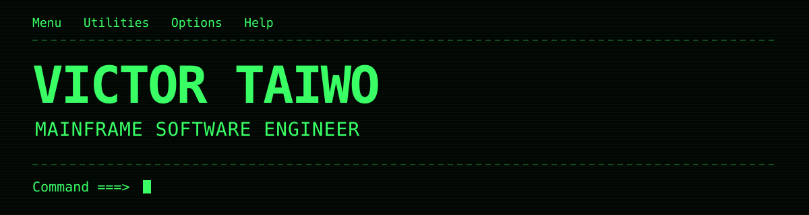

  

- Building **[Zcrafter](https://www.zcrafter.com)** an AI-assisted terminal for mainframe work.
- Previously at **Broadcom**, working on mainframe security and automation.
- Former **IBM Z Student Ambassador** · **2026 Open Mainframe Project Ambassador**.
- Northern Illinois University Alumni 2026 (Computer Science)

### Stack

**Mainframe**

`z/OS` `TSO/ISPF` `COBOL` `JCL` `HLASM` `Zowe` `RACF` `CA Top Secret`

**Languages & tools**

  &nbsp;&nbsp;
  &nbsp;&nbsp;
  &nbsp;&nbsp;
  &nbsp;&nbsp;
  &nbsp;&nbsp;
  

---

[LinkedIn](https://linkedin.com/in/victor-taiwo21) · [Zcrafter](https://www.zcrafter.com) · [Certifications](https://www.credly.com/users/victor-taiwo1)
